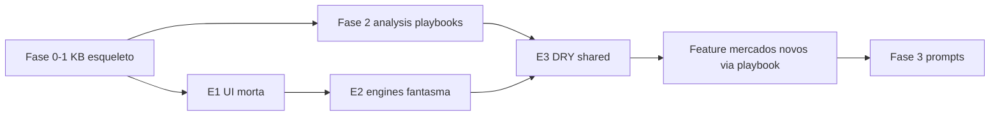

# Plano — KB Betting + Clean Architecture + Boas Práticas

> **Status:** proposto  
> **Objetivo:** reorganizar a documentação de apostas sem duplicar o SDD em `.ai/`, e alinhar o código às mesmas fronteiras (DRY, Clean Architecture, zero código morto).  
> **Não fazer:** big-bang rewrite; criar `docs/architecture/` paralelo ao `.ai/02-architecture/`.

---

## 1. Princípios (vale para doc e código)

| Princípio | Aplicação |
|-----------|-----------|
| **SSOT (Single Source of Truth)** | Uma regra vive em **um** lugar. O resto só linka. |
| **DRY** | Sem copiar liquidação em `analysis/`; sem copiar Score em `markets/`; sem lógica de negócio no frontend. |
| **Clean Architecture** | Domínio/engines no centro; controllers e UI só orquestram; providers de API na borda. |
| **Separação de camadas na KB** | Conhecimento ≠ liquidação ≠ análise ≠ score IA ≠ prompts ≠ integrações. |
| **Sem doc fantasma** | Pasta só existe com conteúdo útil ou `_template` + índice. |
| **Sem código morto** | Remover stubs, handlers vazios, engines “só no AGENTS.md”, UI cosmética sem ação. |
| **Evolução incremental** | Migrar por fase; links quebrados = falha da fase. |

### Fronteiras SSOT (obrigatório)

| Conteúdo | Fonte canônica | Não duplicar em |
|----------|----------------|-----------------|
| Arquitetura, engines, roadmap | `.ai/` | `docs/architecture/` |
| Glossário e regras de casa | `docs/betting/knowledge/` | `markets/` (só link) |
| O que é o mercado / Green-Red-Void | `docs/betting/markets/` | `analysis/`, `ai/` |
| Como analisar e decidir BET/SKIP | `docs/betting/analysis/` | `markets/` (só link) |
| Score, EV, correlação, checklist global | `docs/betting/ai/` | `analysis/` (só pesos específicos do mercado) |
| Gestão de banca / stake / live | `docs/betting/strategy/` | `ai/` |
| Prompts de agentes | `docs/prompts/` | misturados em `markets/` |
| Contrato de APIs externas | `docs/integrations/` | catálogos manuais de times/árbitros |
| Bilhetes reais importados | `docs/betting/data/` | “datasets” markdown eternos |

---

## 2. Estrutura-alvo da documentação

```text
.ai/                          # SDD do produto (já existe — NÃO migrar para docs/)
├── 02-architecture/
├── 04-database/
├── 07-engines/
├── 09-development/           # este plano, TASKS, RULES
└── ...

docs/
├── betting/
│   ├── README.md             # mapa + links SSOT
│   ├── knowledge/            # glossário, regras Bet365, casas (mínimo)
│   ├── markets/              # liquidação (arquivos 01–10 hoje; pastas só se necessário)
│   ├── analysis/             # playbooks por mercado (sucessor do analise.md)
│   │   ├── _pipeline.md      # dados universais + ordem de análise
│   │   ├── _template.md      # template obrigatório por mercado
│   │   └── …                 # um arquivo (ou pasta) por mercado/categoria
│   ├── ai/                   # score, value-bet, correlações, indicadores, checklist
│   ├── strategy/             # bankroll, stake, filtros, ticket-types, live
│   ├── examples/
│   └── data/                 # bilhetes PDF/JSON (já existe)
├── prompts/                  # analyzer, ticket-builder, odds-evaluator, predictor
└── integrations/             # api-football.md (+ sofascore quando houver)
```

### O que **não** entra nesta migração

- `docs/architecture/` — já coberto por `.ai/02-architecture/` e `.ai/07-engines/`
- `betting/datasets/competitions|teams|referees` — dados vivos vêm do sync/DB
- Pastas `markets/results/` vazias “por estética” — só criar pasta quando o arquivo único passar ~400–500 linhas **e** houver ≥2 playbooks de análise

### Papel do `analise.md` atual

1. Fase A: virar `analysis/_pipeline.md` + `analysis/_template.md` + primeiro playbook (`shots-on-target.md`).
2. Remover ou redirecionar `analise.md` → README apontando para `analysis/`.
3. Preencher playbooks na ordem das categorias 01→10 (priorizar o que o engine já modela + SOT/props).

---

## 3. Fases da migração da KB

### Fase 0 — Congelar regras (0,5 dia)

- [x] Atualizar `docs/betting/README.md` com o mapa SSOT (tabela da seção 1).
- [x] Registrar este plano em `TASKS.md` (link).
- [x] Proibir novos conteúdos em `analise.md` monólito; só em `analysis/`.

### Fase 1 — Esqueleto sem mover conteúdo pesado (1 dia)

- [x] Criar pastas: `knowledge/`, `analysis/`, `strategy/`, `prompts/`, `integrations/`.
- [x] Mover (git mv) sem reescrever:
  - `glossary.md` → `knowledge/glossary.md`
  - `strategies/` → `strategy/` (ou merge)
  - `ai/*` permanece; checklist continua em `ai/` (análise global, não banca)
- [x] Criar `analysis/_pipeline.md` e `analysis/_template.md` a partir do cabeçalho de `analise.md`.
- [x] Criar `integrations/api-football.md` (contrato mínimo: endpoints usados, limites, campos).
- [x] Atualizar todos os links internos quebrados.

**Critério:** `rg` / busca por links antigos = 0 quebrados nos README.

### Fase 2 — Separar liquidação × análise (contínuo)

- [x] Lote core: 1X2, O/U gols, BTTS, cantos, cartões, SOT, defesas, anytime, AH gols
- [ ] HT/2T, props jogador restantes, especiais / Bet Builder
- [x] Template + links SSOT markets ↔ analysis
- [ ] Ordem sugerida restante:
  5. HT/2T, Asiáticos (outras linhas), Especiais

**Critério:** nenhum playbook repete tabela Green/Red que já está em `markets/`.

### Fase 3 — Prompts e agentes (quando for implementar IA de mercado)

- [x] `docs/prompts/analyzer.md`, `ticket-builder.md`, `odds-evaluator.md`, `predictor.md`
- [x] Cada prompt **referencia** `analysis/` + `ai/score.md`; não embute regras de liquidação.
- [x] Versionar prompts (data + “compatível com score.md vX”).
- [x] AI Engine injeta `analyzer.md` no system prompt (OpenAI)
- [ ] Ticket Builder / Odds Evaluator consumirem prompts no runtime

### Fase 4 — Mercados em pastas (opcional, sob demanda)

Só quando um arquivo `0X-*.md` ficar ingerível demais:

```text
markets/05-chutes/
  README.md          # índice da categoria
  shots-on-target.md # liquidação
analysis/05-chutes/
  shots-on-target.md # playbook
```

---

## 4. Plano de engenharia (código) — alinhado à mesma arquitetura

### 4.1 Clean Architecture no monorepo

```text
UI (Next)          → hooks / API client          [sem regra de negócio]
Controllers (Nest) → DTOs + auth                 [só HTTP]
Application        → *Service de módulo          [casos de uso]
Domain / Engines   → analysis, statistics, …     [puro, testável]
Infrastructure     → Prisma, API-Football, OpenAI
```

**Regras:**

1. Frontend **zero** cálculo de EV/probabilidade/score — só exibe o que a API devolve.
2. Engines **não** importam Controllers nem Prisma diretamente se já houver porta (preferir interfaces do Data Engine).
3. Providers externos atrás de `DataProvider` (já existe) — novos SofaScore/etc. = novo adapter, **mesmo** contrato.
4. Study tickets ≠ tickets de banca: módulos separados (já); não misturar entidades.

### 4.2 DRY concreto (dívidas conhecidas)

| Dívida | Ação |
|--------|------|
| FALLBACK de médias espalhado / hardcoded | Constantes nomeadas + flag `source: 'fallback'` obrigatória na API/UI |
| Research synthetic vs real | Um único caminho de simulação; synthetic só com `dataSource: 'synthetic'` e UI explícita; meta: desligar por default em prod |
| Probabilidade `0.5` para mercado desconhecido | SKIP explícito, nunca “meio termo” silencioso |
| Labels de status bilhete (UI) | Um mapa `STUDY_STATUS_LABELS` / badges — sem strings soltas |
| Selects nativos vs Shadcn | Padronizar Select do design system (tema escuro) |
| Doc Score IA vs `confidence` do engine | Mapear 1:1 ou documentar conversão; não ter duas escalas sem ponte |
| Contagens README bilhetes (450 vs 448) | Script ou regenerar report no import — README não é SSOT de contagem |

### 4.3 Código morto e duplicado — auditoria por fase

**Fase E1 — UI morta**

- [ ] Sidebar: Plano Pro / tema / Ajuda — implementar ou remover.
- [ ] Buscar `onClick` vazios, botões sem rota, badges cosméticos.

**Fase E2 — Backend / engines fantasma**

- [x] Cruzar `AGENTS.md` / `engines.module.ts` com código real.
- [x] Remover doc de engines inexistentes (MarketEngine, EvEngine, etc.).
- [x] Probabilidade `0.5` silenciosa → `modelSupported: false` + SKIP.
- [ ] Apagar scripts one-off já absorvidos (ou marcar `deprecated` com data).

**Fase E3 — Duplicação de parse/format**

- [ ] `formatCurrency` / `formatOdd` / status maps: `packages/shared` ou `lib/` único.
- [ ] Parser Bet365: uma função de dedupe por `bet365Ref` no import.

**Fase E4 — Testes mínimos por fronteira**

- [ ] Unit: analysis-engine (mercados core), bet365 parser (fixtures PDF→JSON).
- [ ] Contract: DataProvider mock nos testes de sync.
- [ ] Não exigir e2e de tudo; exigir que fallback e synthetic sejam testáveis/assertáveis.

### 4.4 Critérios de “pronto para feature nova” (ex.: SOT / playbook → código)

Antes de modelar um mercado novo a partir de `analysis/`:

1. Playbook existe e linka `markets/` (SSOT liquidação).
2. Campos de dados listados no playbook existem no Prisma **ou** há issue de ingestão.
3. Engine expõe: `probability`, `fairOdd`, `ev`, `score`/`confidence`, `recommendation`.
4. UI só consome DTO — sem reimplementar fórmula.
5. Sem `0.5` silencioso; sem fallback sem `source`.

---

## 5. Ordem de execução recomendada (visão única)



1. **KB esqueleto** (Fases 0–1) — barato, desbloqueia o resto.  
2. **Limpeza UI/engines mortos** (E1–E2) — reduz ruído.  
3. **Playbooks analysis** (Fase 2) em paralelo com curadoria de study tickets.  
4. **DRY shared + dedupe import** (E3).  
5. **Só então** features novas (SOT, defesas, score unificado).  
6. **Prompts** quando o pipeline de análise estiver estável.

---

## 6. Definition of Done (plano completo)

- [ ] Nenhum conteúdo de arquitetura de produto fora de `.ai/`.
- [ ] `docs/betting/analysis/` com `_pipeline` + `_template` + ≥3 playbooks reais.
- [ ] `analise.md` removido ou só redirect.
- [ ] Zero links quebrados no README betting.
- [ ] Sidebar sem ações mortas.
- [ ] Engines documentados = engines existentes (ou removidos da doc).
- [ ] Fallback/synthetic sempre sinalizados na API.
- [ ] Import de bilhetes com dedupe por `bet365Ref`.
- [ ] Nova feature de mercado só nasce a partir de playbook em `analysis/`.

---

## 7. Fora de escopo deste plano

- Reescrever todos os `markets/0X-*.md` de uma vez.
- Multi-tenant / SaaS.
- Catálogos manuais de times/árbitros em markdown.
- Duplicar PRD/Architecture em `docs/`.

---

## 8. Próxima ação imediata

1. ~~Fase 0–3 leve + Score IA + research sem sintético default.~~  
2. **Próximo:** playbooks 2T / props avançadas / especiais; limiar BET por mercado no engine; prompt ticket-builder no runtime.
