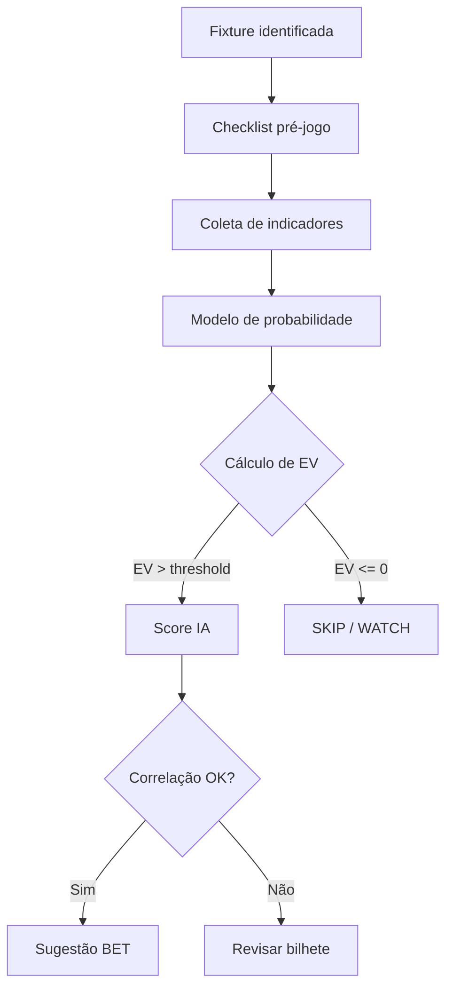

# Betting — Documentação Oficial

> **Módulo:** Soccer Analytics · **Versão da documentação:** 1.0  
> **Público-alvo:** analistas humanos, operadores de banca, engenheiros de produto e agentes de IA  
> **Idioma:** Português (Brasil)

---

## Objetivo desta documentação

Esta documentação constitui a **base de conhecimento oficial** do módulo **Betting** do projeto **Soccer Analytics**. Ela foi projetada para:

1. **Padronizar** o entendimento de mercados de apostas esportivas em futebol.
2. **Registrar regras de liquidação** (Green, Red, Void, Push) conforme práticas de casas como a Bet365.
3. **Orientar análise pré-jogo** com indicadores estatísticos, perfis de partida e checklists.
4. **Alimentar sistemas de IA** que calculam probabilidades, EV (Expected Value), score de confiança e sugestões de mercado.
5. **Servir como referência viva** para evolução do Analysis Engine, Player Engine e Ticket Builder da plataforma.

Esta não é documentação promocional de casa de apostas. O Soccer Analytics é uma **plataforma de inteligência esportiva** — a documentação descreve mercados para **análise, modelagem e gestão de risco**, não incentivo ao jogo.

---

## Organização da documentação

```
docs/betting/
├── README.md                 ← Você está aqui
├── glossary.md               ← Termos e definições
├── markets/                  ← Mercados por categoria (01–10)
├── ai/                       ← Regras e métodos para agentes de IA
└── examples/                 ← Bilhetes modelo com justificativa analítica
```

### Mapa de navegação

| Seção | Caminho | Conteúdo |
|-------|---------|----------|
| Glossário | [glossary.md](./glossary.md) | Definições de odd, stake, EV, xG, handicap, etc. |
| Resultados | [markets/01-resultados.md](./markets/01-resultados.md) | 1X2, dupla chance, handicap europeu, intervalo/final |
| Gols | [markets/02-gols.md](./markets/02-gols.md) | Over/Under, BTTS, placar exato, primeiro gol |
| Escanteios | [markets/03-escanteios.md](./markets/03-escanteios.md) | Totais, por time, asiáticos, intervalo |
| Cartões e faltas | [markets/04-cartoes-faltas.md](./markets/04-cartoes-faltas.md) | Totais, jogador, vermelho, handicap |
| Chutes | [markets/05-chutes.md](./markets/05-chutes.md) | Finalizações, no gol, bloqueadas, por tempo |
| Stats jogador | [markets/06-estatisticas-jogador.md](./markets/06-estatisticas-jogador.md) | Gols, assistências, passes, desarmes |
| Marcadores | [markets/07-marcadores.md](./markets/07-marcadores.md) | Anytime, primeiro, hat-trick |
| Tempo | [markets/08-primeiro-segundo-tempo.md](./markets/08-primeiro-segundo-tempo.md) | HT, 2º tempo, mais gols em qual período |
| Asiáticos | [markets/09-mercados-asiaticos.md](./markets/09-mercados-asiaticos.md) | Handicap, gols, escanteios, cartões |
| Outros | [markets/10-outros-mercados.md](./markets/10-outros-mercados.md) | Posse, impedimentos, especiais |
| IA — Score | [ai/score.md](./ai/score.md) | Escala 0–100 e pesos |
| IA — Correlações | [ai/correlacoes.md](./ai/correlacoes.md) | Dependência entre mercados |
| IA — Indicadores | [ai/indicadores.md](./ai/indicadores.md) | xG, PPDA, shots, etc. |
| IA — Checklist | [ai/checklist.md](./ai/checklist.md) | Análise pré-jogo |
| IA — Value Bet | [ai/value-bet.md](./ai/value-bet.md) | EV, edge, ROI, CLV |
| IA — Probabilidades | [ai/probabilidades.md](./ai/probabilidades.md) | Odds justas e margem |
| Exemplos | [examples/](./examples/) | Bilhetes conservador a agressivo — ver [examples/README.md](./examples/README.md) |

---

## Categorias de mercados

Os mercados de futebol são agrupados em **dez categorias funcionais**. Cada categoria possui arquivo dedicado em `markets/`.

| Código | Categoria | Natureza | Exemplos |
|--------|-----------|----------|----------|
| 01 | Resultados | Desfecho da partida ou período | 1X2, Dupla Chance, Handicap Europeu |
| 02 | Gols | Contagem e distribuição de gols | Over 2.5, BTTS, Placar Exato |
| 03 | Escanteios | Eventos de bola parada lateral | Total Escanteios, Handicap Escanteios |
| 04 | Cartões e faltas | Disciplina e infrações | Over Cartões, Jogador Recebe Cartão |
| 05 | Chutes | Volume e qualidade ofensiva | Finalizações, Shots on Target |
| 06 | Estatísticas de jogador | Props individuais | Passes, Desarmes, Assistências |
| 07 | Marcadores | Quem marca gol | Anytime Scorer, Primeiro Marcador |
| 08 | Primeiro e segundo tempo | Recorte temporal | Resultado HT, Gols 1º Tempo |
| 09 | Mercados asiáticos | Linhas .25/.75, push, meio green | Handicap -0.5, Over 2.25 |
| 10 | Outros | Especiais e estatísticas raras | Posse, Impedimentos, Acréscimos |

### Relação com o Soccer Analytics

| Categoria | Status no Analysis Engine | Engine responsável |
|-----------|---------------------------|-------------------|
| Resultados, Gols | ✅ Modelado (Poisson) | Analysis Engine |
| Escanteios, Cartões | ✅ Modelado (Poisson O/U) | Analysis Engine |
| Handicap asiático | ✅ Modelado (matriz Poisson) | Analysis Engine |
| Marcadores | ✅ Parcial (Player Engine) | Player Engine |
| Chutes, Stats jogador, HT/2T | 🔜 Roadmap | Statistics / Player Engine |

---

## Como utilizar esta documentação

### Para analistas humanos

1. Leia o [glossário](./glossary.md) antes de operar mercados desconhecidos.
2. Abra o arquivo da categoria desejada em `markets/`.
3. Localize o mercado pelo título (`# Nome do Mercado`).
4. Siga a seção **Checklist** antes de incluir a seleção em um bilhete.
5. Consulte [ai/value-bet.md](./ai/value-bet.md) para validar se há valor esperado positivo.
6. Use [examples/](./examples/) como referência de montagem e correlação.

### Para agentes de IA

1. **Ingestão:** indexar todos os arquivos `.md` como knowledge base.
2. **Pré-análise:** executar [ai/checklist.md](./ai/checklist.md) e coletar indicadores de [ai/indicadores.md](./ai/indicadores.md).
3. **Modelagem:** aplicar fórmulas de [ai/probabilidades.md](./ai/probabilidades.md) e [ai/value-bet.md](./ai/value-bet.md).
4. **Score:** calcular confiança com [ai/score.md](./ai/score.md).
5. **Correlação:** validar bilhetes com [ai/correlacoes.md](./ai/correlacoes.md) antes de sugerir combinações.
6. **Liquidação:** usar seções **Como a Bet365 contabiliza** para simular backtest.

### Fluxo recomendado de análise



---

## Como adicionar novos mercados

Siga este protocolo para manter consistência com a documentação existente e com o código da plataforma.

### Passo 1 — Classificar o mercado

Determine a categoria (01–10). Se não couber em nenhuma, use `10-outros-mercados.md` e avalie criação de nova categoria na próxima versão.

### Passo 2 — Documentar no Markdown

Copie o **template oficial** abaixo e preencha todas as seções. Não omita Green, Red ou Void.

```markdown
# Nome do Mercado

## O que é
...

## Como funciona
...

## Como a Bet365 contabiliza
...

## Exemplo GREEN
...

## Exemplo RED
...

## Exemplo VOID
...

## Mercados relacionados
...

## Quando utilizar
...

## Quando evitar
...

## Indicadores importantes
...

## Perfil ideal
...

## Perfil ruim
...

## Riscos
...

## Odds médias
...

## Grau de dificuldade
...

## Checklist
- [ ] ...
```

### Passo 3 — Atualizar o glossário

Novos termos devem ser adicionados em [glossary.md](./glossary.md) com definição, fórmula (se houver) e referência cruzada.

### Passo 4 — Integrar à IA

| Arquivo | Ação |
|---------|------|
| `ai/indicadores.md` | Adicionar stats necessárias |
| `ai/correlacoes.md` | Mapear correlações com mercados existentes |
| `ai/score.md` | Ajustar pesos se o mercado for volátil ou líquido |
| `ai/checklist.md` | Incluir itens específicos do mercado |

### Passo 5 — Integrar ao código (quando aplicável)

1. Adicionar `MarketType` em `schema.prisma` se for mercado modelado.
2. Mapear odds em `api-football.provider.ts`.
3. Implementar probabilidade em `analysis-engine.service.ts` ou `player-engine.service.ts`.
4. Atualizar `.ai/09-development/TASKS.md`.

### Passo 6 — Revisão

- [ ] Todas as seções do template preenchidas
- [ ] Exemplos numéricos verificados
- [ ] Links cruzados no README
- [ ] Termos no glossário

---

## Convenções

### Linguagem e tom

- Português brasileiro, tom técnico e neutro.
- Evitar jargão sem definição — use o glossário.
- Diferenciar **probabilidade modelada** de **opinião subjetiva**.

### Notação de odds

- Odds em formato **decimal europeu** (ex.: `2.00`, `1.85`).
- Probabilidade implícita: `P = 1 / odd`.

### Notação de placar

- Formato `Casa-Fora` (ex.: `2-1` = mandante 2, visitante 1).
- Intervalo: `HT 1-0` = placar ao fim dos 45 min + acréscimos do 1º tempo.

### Liquidação (resultado da aposta)

| Termo | Significado |
|-------|-------------|
| **GREEN** | Aposta ganha |
| **RED** | Aposta perdida |
| **VOID** | Aposta anulada — stake devolvido |
| **PUSH** | Empate na linha (comum em asiáticos) — stake devolvido |
| **HALF WIN / HALF LOSS** | Meio green ou meio red (linhas .25/.75) |

### Grau de dificuldade

Escala usada em todos os mercados:

| Nível | Descrição |
|-------|-----------|
| Muito Baixo | Alta previsibilidade em amostras grandes (ex.: Over 0.5 gols em jogo de alta média) |
| Baixo | Mercados de favorito claro com linha conservadora |
| Médio | Maioria dos mercados principais (1X2, Over 2.5, BTTS) |
| Alto | Props de jogador, placar exato, eventos raros |
| Muito Alto | Combinações múltiplas, hat-trick, mercados promocionais |

### Referência à Bet365

As seções **Como a Bet365 contabiliza** descrevem regras **geralmente aplicáveis** na Bet365 e casas similares. Regras podem variar por jurisdição, competição ou alteração de termos. Em caso de dúvida, consulte os termos oficiais da operadora.

### Versionamento

Ao alterar regras ou adicionar mercados, incremente a versão no topo do README e registre em changelog do projeto.

---

## Contribuição

1. Branch a partir de `main`.
2. Edite apenas arquivos em `docs/betting/`.
3. Mantenha o template completo para cada mercado novo.
4. Pull request com descrição do mercado e impacto na IA.

---

## Referências externas

- [Opta / Stats Perform](https://www.statsperform.com/) — definições de eventos
- [FBref](https://fbref.com/) — xG e estatísticas avançadas
- Documentação interna: `.ai/07-engines/ANALYSIS_ENGINE.md`

---

*Soccer Analytics — Betting Module Documentation · Última atualização: 2026*
