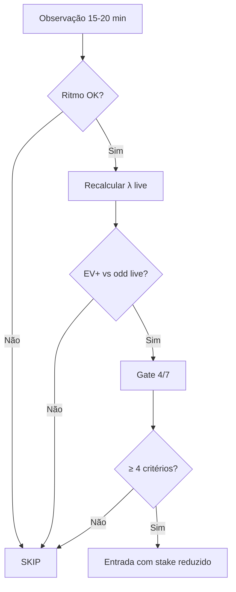

# Estratégias — Apostas Ao Vivo (In-Play)

> Métodos de **entrada tardia** com filtros estatísticos · complementa mercados em [02-gols](../markets/02-gols.md), [03-escanteios](../markets/03-escanteios.md), [08-primeiro-segundo-tempo](../markets/08-primeiro-segundo-tempo.md)

**Aviso:** critérios abaixo são **filtros operacionais**, não taxa de acerto garantida. Validar sempre com EV modelado e [marcado-de-atuacao.md](../ai/marcado-de-atuacao.md).

---

## Princípios gerais

1. **Observar antes de entrar** — 15–20 minutos mínimo (exceto mercados pré-definidos).
2. **Odd mínima** — só entrar se a live odd ainda oferece EV+ vs probabilidade atualizada.
3. **Abortar** — jogo travado além do tempo limite (25–30') sem ritmo.
4. **Ligas abertas** — preferir perfis de [ligas.md](../ai/ligas.md) (Bundesliga, Eredivisie, etc.).

---

## 1. Over 1.5 Gols FT (live)

| Parâmetro | Valor |
|-----------|-------|
| **Mercado** | Over 1.5 gols tempo regulamentar |
| **Timing** | Após **15'** sem gol |
| **Odd mínima** | ≥ 1,40 |
| **Abortar se** | Jogo travado até **30'** (poucos chutes, sem cantos) |

### Filtros pré-jogo

- Média gols **> 2,5** nos últimos 10 jogos (ambos ou soma λ).
- Liga aberta (Alemanha, Holanda, Suécia, etc.).
- Gate [marcado-de-atuacao](../ai/marcado-de-atuacao.md): critério Over 1.5 FT (BTTS ≥ 70%).

### Atualização live

Recalcular λ com: chutes, SOT, cantos, posse nos primeiros 15'. Se λ_live < 1,2 → **não entrar**.

---

## 2. Over 0.5 HT (live)

| Parâmetro | Valor |
|-----------|-------|
| **Mercado** | Over 0.5 gols 1º tempo |
| **Timing** | Após **15'** sem gol |
| **Odd mínima** | ≥ 1,50 |
| **Abortar se** | Travado até **25'** |

### Filtros

- Média gols **1T > 1,5** ou Over 0.5 HT ≥ 75% histórico.
- Times ofensivos no XI.
- Ligas: Holanda, Alemanha, Suécia, Japão, Brasil Série B.

Ver mercado completo: [08-primeiro-segundo-tempo.md](../markets/08-primeiro-segundo-tempo.md).

---

## 3. Escanteios Over 8.5 / 9.5 (live)

| Parâmetro | Valor |
|-----------|-------|
| **Mercado** | Total escanteios Over 8.5 ou 9.5 |
| **Timing** | Após **15–20'** |
| **Odd mínima** | ≥ 1,50 |
| **Sinal verde** | ≥ **3 cantos** no 1T até o momento |

### Filtros

- Média escanteios **> 5/jogo** por time (ou soma > 10).
- Favorito pressionando (posse, cruzamentos).
- Escalações ofensivas (gate 4/7).

Ver: [03-escanteios.md](../markets/03-escanteios.md).

---

## 4. BTTS (live ou pré)

| Parâmetro | Valor |
|-----------|-------|
| **Mercado** | BTTS Sim |
| **Timing** | Pré-jogo ou live 0-0 até 30' com ritmo |
| **Odd típica** | 1,70 – 2,00 |

### Filtros

- Ataques fortes **e** defesas frágeis (xGA alto).
- BTTS nos últimos 5 jogos: **≥ 4/5** para ambos ou confronto direto.
- Ligas: Alemanha, Holanda, Suécia, Bélgica.
- **Evitar** se ataque desfalcado (lesão artilheiro).

---

## Fluxo de decisão (live)

**Stake live:** 50–75% do stake pré-jogo padrão (maior incerteza).

---

## Status Soccer Analytics

| Recurso | Status |
|---------|--------|
| Over/Under Poisson | ✅ Analysis Engine |
| λ live (chutes/cantos) | 🔜 Roadmap |
| Próximo gol | 🔜 Live module |
| Alertas 15'/25' | 🔜 Sync + notificações |

---

## Referências

- [marcado-de-atuacao.md](../ai/marcado-de-atuacao.md)
- [ligas.md](../ai/ligas.md)
- [value-bet.md](../ai/value-bet.md)
- [02-gols.md](../markets/02-gols.md) — Próximo Gol (live)
